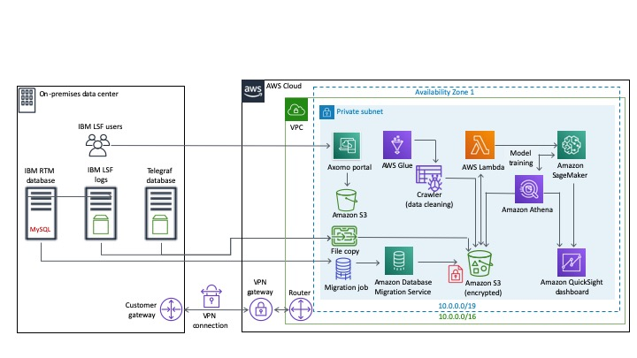

# quickstart-mactores-eldorado
## Axomo on the AWS Cloud

This Quick Start is for users who manage IBM LSF Clusters and want to optimize and predict the cluster resources and license consumption of jobs on LSF Cluster.

Axomo solves the industry wide problem for companies using a large portion of their budget on licenses and hardware from inefficient resource allocation, and opportunity cost from loss of productivity. The user of the Axomo solution will experience advance analytics outcomes with a comprehensive pre-built dashboard which provides insights for licensing, job type-based views, identifies underutilized hardware and misconfiguration and provides the Intelligent queueing for job assignment to optimize cluster and license utilization

The AWS CloudFormation templates included with the Quick Start automate the following:

- [Deploying Axomo into a new VPC](https://us-west-2.console.aws.amazon.com/cloudformation/home?region=us-east-2#/stacks/new?stackName=Axomo&templateURL=https://aws-quickstart.s3.amazonaws.com/quickstart-mactores-eldorado/templates/el-dorado-master-new-vpc.template)
- [Deploying Axomo into your existing AWS](https://us-west-2.console.aws.amazon.com/cloudformation/home?region=us-east-2#/stacks/new?stackName=Axomo&templateURL=https://aws-quickstart.s3.amazonaws.com/quickstart-mactores-eldorado/templates/el-dorado-workload.template)

